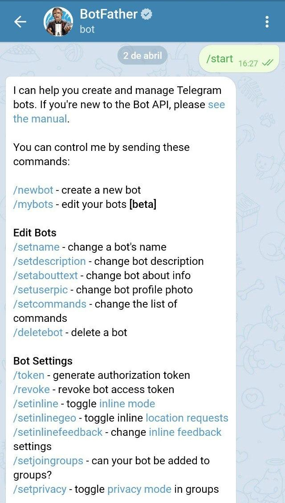
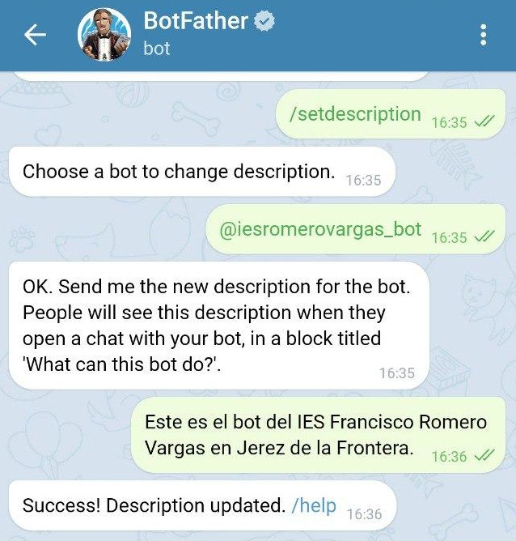
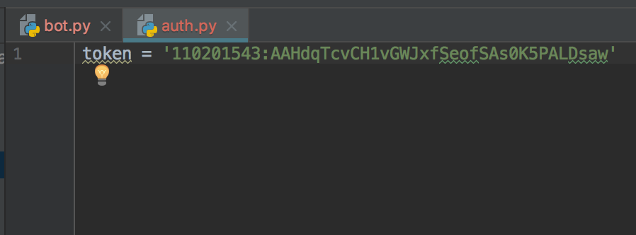
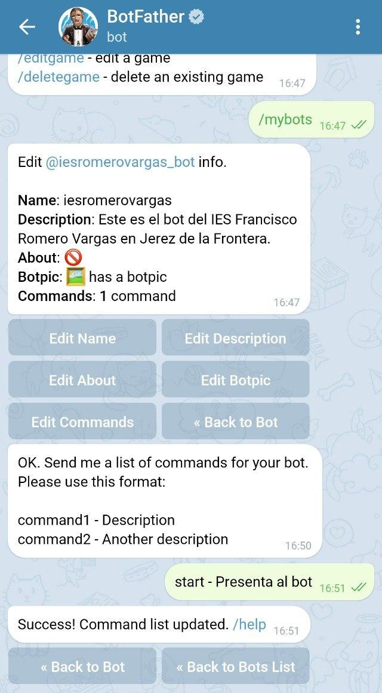

# Bots de Telegram en python

Este documento pretende ser una pequeña guía sobre cómo desarrollar un bot básico.

## ¿Qué es eso de un bot?

Es un programa capaz de **engancharse** a una conversación de un sistema de mensajería, atender a los mensajes de los usuarios e interactuar con estos de distintos modos.

Uno de estos modos consiste en tener una serie de comandos que desencadenen **acciones preprogramadas**, cuando el usuario lanza uno de estos comandos, el bot hace algo concreto. Los comandos, en el caso de los bots de Telegram, siempre empiezan por un carácter “/”




Por ejemplo, si un nuevo bot entiende un comando `/list_languages`, cuando un usuario de una conversación en la que está presente escribe `/list_languages`, el bot devuelve una lista con nombres de lenguajes de programación. Lo que ocurrirá es que se tendrá un nuevo mensaje en la conversación, enviado por el bot, en respuesta al comando.

### Bots inline

Otro modo de actuar totalmente distinto es el de los ***bots inline***. Los bots inline esperan que el resto de miembros de la conversación empiecen un nuevo mensaje haciendo mención a su nombre precedido del carácter `@`. Se han desarrollado múltiples bots inline muy interesantes, por ejemplo, `@gif` que espera que se le pase un texto y devuelve gifs relacionados con el mismo.


Si se escribe `@gif` en cualquier conversación de Telegram se puede buscar gif’s animados de una manera muy simple. Es un ejemplo de bot inline.

También están los que viven agazapados en la ventana de chat y actúan espontáneamente reaccionando a los propios mensajes.

# Generando un bot

Los desarrolladores de Telegram han elegido un método muy llamativo para **solicitar las credenciales** necesarias para comenzar a trabajar con su API de bots. Básicamente *hay que abrir una conversación* con `@BotFather` desde el propio Telegram. `@BotFather` es un bot a su vez y reconoce una serie de comandos.

El que nos ocupa es `/newbot`, que pedirá que se introduzca un nombre para el  nuevo esbirro digital así como un nombre de usuario.


Los dos datos pueden parecer lo mismo pero no lo son. El nombre aparecerá en la información de contacto del bot sin embargo, el nombre de usuario (*bot_user_name*) debe terminar siempre en `bot` y será el identificador que se utilizará cuando se haga mención al bot en una ventana de chat, en nuestro caso sería `@iesromerovargas_bot`. De hecho, una manera de abrir una conversación con este bot es, simplemente, dirigirse a la url `http://t.me/<bot_user_name>`, en nuestro caso `http://t.me/iesromerovargas_bot`

Una vez ejecutado, la respuesta remota a la solicitud tendrá forma de mensaje y dentro de éste se encontrará un texto con algo así como:

```
Use this token to access the HTTP API:
110201543:AAHdqTcvCH1vGWJxfSeofSAs0K5PALDsaw
```

Esta ristra de números y letras es el identificador del bot, al que todo el mundo se refiere como token y **debería cuidarse**. Cualquiera que utilice ese token será, a efectos de la API de Telegram, nuestro bot. Esto tendrá sentido en un momento -por cierto, ese token no es válido, ;-).

Lo siguiente que se debe hacer es lanzar, en la conversación con `@BotFather`, el comando `/setdescription`; con él se podrá introducir un texto breve que sirva para presentar en sociedad al bot. Cada vez que alguien abra una conversación con él, verá esta descripción.



Por último, habrá que ponerle cara, así que habrá que buscar una imagen adecuada y, una vez más, dentro de la ventana de la conversación con “@BotFather”, lanzar el comando `/setuserpic “@BotFather”`. Pedirá que se suba una imagen de la galería que pasará a ser la imagen del perfil del bot.


Todas las piezas están en su sitio, el bot existe, tiene un nombre y una imagen de perfil, ahora toca darle un poco de vida.

# Dando vida al bot

Para Python existen varias librerías con las que desarrollar bots de Telegram, unas más eficientes que otras, para este ejemplo nos vamos a centrar en `python-telegram-bot`. Se puede acceder a su repositorio en la siguiente dirección: 

https://github.com/python-telegram-bot/python-telegram-bot

Para instalarla no hay más que ejecutar:

```bash
pipenv install python-telegram-bot
```

Del mismo modo, también tenemos creado un repositorio en github para este proyecto. Si te sientes perdido o no entiendes algo, [aquí](https://github.com/mentecatoDev/bots_de_telegram_en_python.git) está disponible el código que lo implementa.

Cada paso formará parte de una nueva rama del repositorio así se puede hacer un seguimiento secuencial del mismo y volver atrás cuando sea necesario.

La estructura del proyecto es muy simple:


En este primer momento, todo el código que hará que el bot cobre vida estará en el archivo `bot.py`. La mayoría de ejemplos siguen esta misma estructura, sin embargo, vamos a añadir un paquete de Python mínimo dentro del directorio *config* que permita aislar el token de autenticación del repositorio. De esta manera, solamente se tendrá que añadir un archivo denominado `auth.py` tal y como se muestra en la imagen e incluir dentro de él el token del bot como se puede ver a continuación.



Este valor debe ser el token que ofreció “@BotFather” cuando se solicitó la creación del bot. Supóngase que el Token que se devolvió fue este: `110201543:AAHdqTcvCH1vGWJxfSeofSAs0K5PALDsaw`

Como última precaución, se editará el fichero `.gitignore` para que no se pueda almacenar por error los datos de autenticación en el repositorio.


Vamos a empezar con un código mínimo que nos permita interactuar con el bot. Dentro del fichero `bot.py` se encontrará lo siguiente:

```python
from telegram.ext import Updater
from config.auth import token
if __name__ == '__main__':
    updater = Updater(token=token, use_context=True)
    dispatcher = updater.dispatcher
```

Si ahora se ejecuta este código utilizando el intérprete de Python se verá que el resultado es bastante pobre, básicamente, tras poco más de un segundo el programa terminará sin errores.

El objeto `Updater` es el responsable de enviar las *“reacciones”* del bot de vuelta a las ventanas de chat. Por ejemplo, si un usuario enviase el comando `/start` al bot, `Updater` sería el que sabría cómo debe responder a ese comando.

Para inicializar el bot, habrá que pasarle el token que nos identifica unívocamente en los *servidores de Telegram*.

El propio objeto `Updater` nos devuelve la referencia a otro objeto importantísimo, el `dispatcher`. *Si el bot fuera un ser vivo, el `dispatcher` sería su oreja.* La función del *dispatcher* es mantenerse a la escucha en todas las ventanas de chat en las que esté presente el ente digital.

# Un poco de feedback

Lo siguiente que se ha de hacer es que el bot devuelva algo de información. Para lograrlo importaremos una nueva librería, `logging`.

La función de esta librería es registrar eventos, devolver información sobre el estado del bot. Es un software bastante versátil, se puede conectar directamente a los registros del sistema operativo. Solamente se utilizará para que muestre por pantalla la información que se considere oportuna.

La manera de utilizar `logging` puede parecer un poco extraña, pero se verá que no es tan compleja como parece.

```python
import logging

logging.basicConfig(format='%(asctime)s - %(name)s - %(levelname)s - %(message)s', level=logging.INFO)
logger = logging.getLogger('AchicaynaBot')
```

La primera línea importa la librería. La segunda línea, sin embargo sí empieza a ser interesante. Lo que hacemos es **configurar qué información se va a almacenar** cada vez que se registre un evento.

El primer argumento es `format` y, en este caso, se ha decidido configurar las salidas de esta manera:

```python
format='%(asctime)s - %(name)s - %(levelname)s - %(message)s'
```

Esto no significa otra cosa más que se quiere que cada línea comience con la fecha y hora en un formato como el siguiente: `2019–01–13 22:19:36,146`

A continuación, separado por un guión, aparecerá el nombre del bot, un nuevo guión y el nivel del registro que se está mostrando y, por último, el mensaje que el bot quiere mostrar.

El segundo argumento es `level` que establece la **gravedad mínima** que tiene que tener un evento para que el bot decida molestar.

Los mensajes de registro suelen tener una jerarquía donde los mensajes menos prioritarios son aquellos que los programadores utilizan para buscar errores en el código y los más importantes son aquellos que, de producirse, podrían hacer que la aplicación no pudiera continuar funcionando. Por orden de menor a mayor prioridad, se diría que los **niveles de registro** son: *debug*, *info*, *warning*, *error* y *critical*. Si no se indica otra cosa, la librería `logging` está configurada para mostrar mensajes con categoría mínima de *warning*. Esta categoría de eventos representa un aviso de que ha ocurrido algo inesperado.

Si se deja esta configuración tal cual, la información que se espera recibir no se mostraría, porque no es algo inesperado, así que se establece el nivel mínimo de prioridad en info. Esto se hace pasando el siguiente valor como segundo argumento:

```python
level=logging.INFO
```

Por último, se almacena en la variable `logger` una instancia del objeto `logger` que permita enviar un mensaje.

De manera que, si se quisiere enviar un mensaje al usuario para informarle de que está ocurriendo algo se haría uso de alguno de los siguientes métodos.

```python
logger.debug('Este mensaje es sólo para frikis programadores como nosotros')
logger.info('Este mensaje representa algo normal')
logger.warning('Esto ya no es tan normal')
logger.error('Deberías empezar a preocuparte')
logger.critical('El bot está así X(')
```

En primer lugar, vamos a hacer que pueda responder a su primer comando. Este comando será `/start` y como respuesta enviará un mensaje al chat en el que diga: *“Soy de Jerez de la Frontera, cuna del fino, de los caballos cartujanos y Capital Mundial del Motociclismo”*.

Habrá que hablar de nuevo con `@BotFather` e indicarle que se quiere configurar el bot. Para ello se le envía el comando `/mybots`, que listará todos los bots que se han creado hasta la fecha.


Con el comando `/mybots` siempre se puede consultar la lista de los bots creados.

Una vez seleccionado el bot, dará una serie de opciones que permiten configurar distintos aspectos del mismo.


Seleccionar la opción “Edit Bot” y una vez allí “@BotFather” ofrecerá un nuevo menú.


En este menú se puede definir la lista de comandos del bot.

Para informar a Telegram de los comandos que entenderá el bot bastará con pulsar sobre el botón “Edit Commands”. Una vez más, la manera de establecer esa lista de comandos es muy original. Habrá que enviarle un mensaje a “@BotFather” con el siguiente formato:

```text
comando1 - Texto explicativo sobre el comando1.
comando2 - Texto explicativo sobre el comando2.
```




Se añade el comando `start`.

Una vez hecho esto, se está listo para indicar al bot cómo debe reaccionar cuando reciba el único comando que entenderá de momento.

En primer lugar se programa la función que se hará cargo de esta respuesta. A estas funciones se les llama “**handlers**” y siempre tienen la misma estructura.

```python
def start(update: Updater, context: CallbackContext):
    logger.info('He recibido un comando start')
    context.bot.send_message(
        chat_id=update.message.chat_id,
        text="Soy de Jerez de la Frontera, cuna del fino, de los caballos cartujanos y Capital Mundial del Motociclismo")
```

Reciben como argumento dos parámetros: `update` que representa el mensaje que ha desencadenado que se llame a esta función, en este caso, el comando `/start` y `context`, que representa al propio bot y provee de métodos para enviar mensajes.

La primera línea añadirá una salida a nuestro registro para que nos avise de que se ha recibido el comando.

La segunda línea inyectará en el chat, desde el que se ha lanzado el comando, un mensaje de parte de `iesromerovargas`.

Ahora hay que indicarle al *dispatcher* qué queremos hacer cuando recibamos cada comando. En esta caso aún sólo se ha definido uno, así que la cosa será fácil.

Habrá que importar `CommandHandler` desde `telegram.ext`

```python
from telegram.ext import CommandHandler
```

Este objeto recibe como parámetros tanto la cadena de texto del comando (sin la barra inicial), como el nombre de la función que deberá ejecutarse cuando se reciba, el famoso “handler”.

Y todo esto se dará de alta en el dispatcher usando el siguiente código:

```python
dispatcher.add_handler(CommandHandler('start', start))
```

Esto viene a significar: “Dispatcher, cuando recibas un comando `‘start’` ejecuta la función `start`”

Finalmente hay que decirle al objeto `updater` que esté atento a cualquier mensaje que pueda llegarle al bot y que mientras no reciba ninguno que se mantenga a la espera. Esto se hace con estas dos nuevas líneas de código:

```python
updater.start_polling()
updater.idle()
```

El código final del bot quedaría de este modo:

```python
from telegram.ext import Updater, CommandHandler, CallbackContext
from config.auth import token

import logging

logging.basicConfig(format='%(asctime)s - %(name)s - %(levelname)s \
    - %(message)s', level=logging.INFO)
logger = logging.getLogger('romerovargasbot')


def start(update: Updater, context: CallbackContext):
    logger.info('He recibido un comando start')
    context.bot.send_message(
        chat_id=update.message.chat_id,
        text="Soy de Jerez de la Frontera, cuna del fino, de los caballos cartujanos y Capital Mundial del Motociclismo")


if __name__ == '__main__':

    updater = Updater(token=token, use_context=True)
    dispatcher = updater.dispatcher

    dispatcher.add_handler(CommandHandler('start', start))

    updater.start_polling()
    updater.idle()

```

Si ejecutásemos el bot haciendo uso del comando `python src/bot.py` se podrá comenzar a conversar con `iesromerovargas`, aunque, por ahora, es un bot un poco soso.


Nuestra primera breve conversación con `iesromerovargas`.

En la próxima entrega vamos a hacer que `iesromerovargas` no sólo reaccione a comandos sino que esté pendiente de lo que se escribe en las ventanas de chat en las que participe.

[Fuente](https://medium.com/@goyoregalado/bots-de-telegram-en-python-134b964fcdf7)

