# La tortuga que dibuja

En 1967 *Wally Feurzeig* y [*Seymour Papert*](https://www.youtube.com/watch?v=2js2cFrtg8I) crearon **Logo**, un lenguaje de programación con fines educativos. Ese lenguaje incluía los "gráficos de tortuga". La "tortuga" de Logo es un cursor al que se le pueden dar órdenes de movimiento (avance, retroceso o giro) y que puede ir dejando un rastro sobre la pantalla. Moviendo adecuadamente la tortuga se puede conseguir dibujar todo tipo de figuras.

Python incluye un módulo llamado `turtle` que permite crear éste tipo de **gráficos tortuga**.

## El primer programa con tortugas

Se van a trazar un par de líneas en la terminal de Python para crear una nueva tortuga y empezar a dibujar un rectángulo. (La variable que refiere a la primera tortuga se llamará `raphael`).

FICHERO: `tortuga01.py`

```python
import turtle

# Set the window size to 800x600 pixels at (0, 0)
turtle.setup(800, 600, 0, 0)

# Set the Screen object as wn
wn = turtle.Screen()

# Creates the turtle
leonardo = turtle.Turtle()
leonardo.forward(300)
leonardo.left(90)
leonardo.forward(200)

turtle.done()

```

Tras la segunda instrucción, se abrirá una nueva ventana. El tercer comando coloca un cursor – llamando cariñosamente a una `tortuga` del módulo – a la que se le ha puesto el nombre de `raphael`. Las siguientes tres líneas mueven a `raphael` hacia adelante, gira hacia la izquierda, y lo mueve hacia adelante una vez más, completando dos lados de un rectángulo. Después de introducir estos comandos, aparecerá una ventana que se parece a esto:

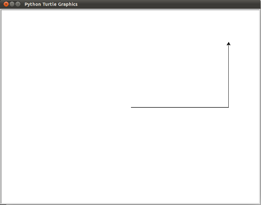

Aquí hay un par de cosas que se necesita entender acerca de este programa.

- La primera línea le dice a Python que cargue un módulo llamado `turtle`. Dicho módulo trae dos nuevos tipos que se pueden utilizar: el tipo de `Turtle`, y el tipo de `Screen`. La notación de puntos `turtle.Turtle` significa *“El tipo* `Turtle` *definido en el módulo* `turtle`*”* (Python distingue entre mayúsculas y minúsculas, así que el nombre del módulo, con una `t` minúscula, es diferente al que la tiene mayúscula).
- A continuación, se crea y abre lo que llamamos una `screen`, que se asigna a la variable `wn`. Cada `screen` contiene un **lienzo (canvas)**, que es el área dentro de ella en la que se puede dibujar. En la siguiente línea se crea una tortuga. La variable `leonardo` se usa para referirse a ella. Estas tres primeras líneas son la preparación para ahora hacer algunas cosas útiles.
- A continuación se instruye al **objeto** `leonardo` para que se mueva, y que gire. Se hace mediante la **invocación** a los **métodos** de `leonardo` — instrucciones a las que todas las tortugas saben cómo responder.
- La última línea también desempeña un papel: la variable `wn` se refiere a la ventana activa. Cuando se invoca el método `exitonclick`,  se detiene la ejecución del programa y se espera a que el usuario haga clic con el ratón en algún lugar de la ventana. Cuando este evento click se produce, la respuesta es cerrar la ventana de la tortuga y la salida (la ejecución de la parada) del programa de Python.

Un objeto puede tener varios métodos —las cosas que puede hacer— y también puede tener **atributos** (también llamados *propiedades*). Por ejemplo, cada tortuga (`Turtle`) tiene un atributo `color`. El modo de invocarlo es `leonardo.color("red")` que hará a `leonardo` rojo, y el dibujo será de color rojo también. El color de la tortuga, la anchura de la pluma, la posición de la tortuga dentro de la ventana, la apariencia, etc. son partes de su **estado** actual. Del mismo modo, el objeto `Screen` tiene un color de fondo y un texto en la barra de título, y un tamaño y posición en la pantalla. Todos ellos forman parte del estado del objeto `screen`. Hay un buen número de métodos que nos permiten modificar tortugas y screens. Vamos a mostrar un par:

FICHERO: `tortuga02.py`

```python
import turtle

# set the window size to 800 by 600 pixels at (0, 0)
turtle.setup(800, 600, 0, 0)

# set wn as a window object
wn = turtle.Screen()  

# set the background color of the window
wn.bgcolor("lightgreen")

# set the title of the window
wn.title("¡Hola, Raphael!")
raphael = turtle.Turtle()
raphael.color("blue")      # make raphael blue
raphael.pensize(3)         # set the width of the pen
raphael.forward(300)
raphael.left(120)
raphael.forward(300)

turtle.done()

```

La ejecución de este programa creará una ventana gráfica que se verá así:

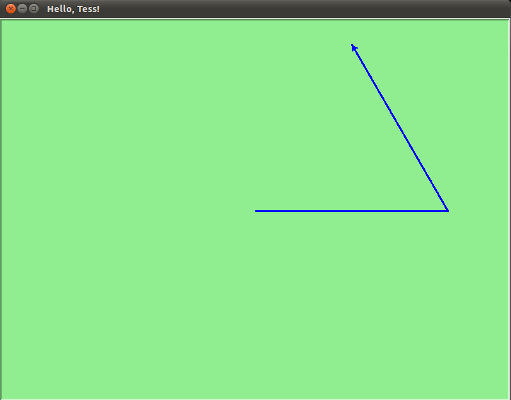

Cuando se ejecuta este programa aparece esta nueva ventana y permanecerá en pantalla hasta que se haga clic en ella.


> Nota:
>
> Se puede encontrar una lista de nombres de colores permitidos en http://www.tcl.tk/man/tcl8.4/TkCmd/colors.htm. Incluye algunos bastante inusuales, como `peach puff` (bocanada de melocotón) y `HotPink` (rosa caliente)

## Una manada de tortugas

Al igual que podemos tener muchos enteros diferentes en un programa, podemos tener muchas tortugas. Cada una de ellas es una **instancia**. Cada instancia tiene sus propios atributos y métodos -por lo que `raphael` puede dibujar con un lápiz negro delgado y estar en alguna posición, mientras que `donatello` podría ir en su propia dirección con un bolígrafo de color rosa grueso (`fat pink`). Aquí está lo que sucede cuando `raphael` termina su rectángulo, y `donatello` completa su triángulo:

FICHERO: `tortuga03.py`

```python
import turtle

# setup the window and its attributes
turtle.setup(800, 600, 0, 0)
wn = turtle.Screen()
wn.bgcolor("lightgreen")
wn.title("donatello & raphael")

# instantiate (create) donatello and set his attributes
donatello = turtle.Turtle()
donatello.color("hotpink")
donatello.pensize(5)

# instantiate raphael
raphael = turtle.Turtle()

# draw an equilateral triangle with donatello
donatello.forward(320)
donatello.left(120)
donatello.forward(320)
donatello.left(120)
donatello.forward(320)
donatello.left(120)

# turn donatello around and move her away from the origin
donatello.right(180)
donatello.forward(320)

# make raphael draw a square
raphael.forward(200)
raphael.left(90)
raphael.forward(200)
raphael.left(90)
raphael.forward(200)
raphael.left(90)
raphael.forward(200)

turtle.done()

```

que genera esto cuando se ejecuta:

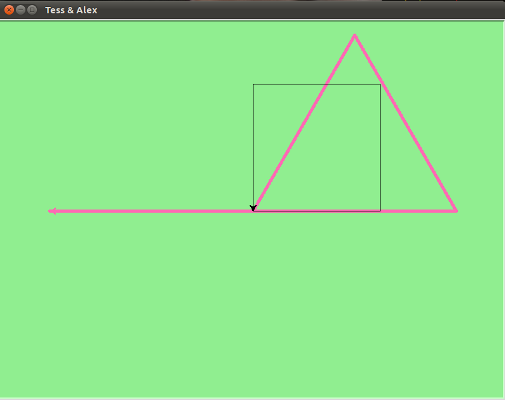

## Algunos trucos y métodos de tortugas

Los métodos de la tortuga pueden utilizar ángulos y distancias negativas. Así `donatello.forward(-100)` moverá a donatello hacia atrás y `donatello.left(-30)` la gira a la derecha.

Además, dado que hay 360 grados en un círculo, al girar 30 a la izquierda se estará en la misma situación que si se gira 330 a la derecha! (La animación en la pantalla será diferente).También hay un método `backward` (si se es muy nerd, uno puede disfrutar de mover a `raphael` hacia adelante mediante `raphael.backward(-100)`).

El lápiz de la tortuga se puede levantar (`penup`) o apoyar (`pendown`).  Esto nos permite mover una tortuga a un lugar diferente sin dibujar una línea. Los métodos son 

```python
raphael.penup()
raphael.forward(100)   # esto hace que se mueva raphael sin dibujar una línea raphael.pendown ()
```

Cada tortuga puede tener su propia forma. Las que están disponibles  son `arrow` (flecha), `blank` (espacio en blanco), `circle` (círculo), `classic` (clásico), `square` (cuadrado), `triangle` (triángulo), `turtle` (tortuga).

```python
raphael.shape("turtle")
```

Se puede acelerar o ralentizar la **velocidad** de la animación de la tortuga. El ajuste de velocidad varía entre 1 (lento) a 10 (más rápido). Sin embargo, si se establece la velocidad a 0 se **desactivará la animación** y se irá lo más rápido posible.

```python
raphael.speed(10)
```

Una tortuga puede crear un “sello” (`stamp`) de su huella en el lienzo que seguirá así después de que la tortuga se haya movido a otra parte. Se sella, aun cuando la pluma esté arriba.

El siguiente ejemplo muestra algunas de estas nuevas características:

FICHERO: `tortuga04.py`

```python
import turtle

turtle.setup(800, 600, 0, 0)
wn = turtle.Screen()
wn.bgcolor("lightgreen")
wn.title("Donatello's Spiral")
donatello = turtle.Turtle()
donatello.shape("turtle")
donatello.color("blue")

donatello.penup()            # this is new
size = 20
for i in range(30):
    donatello.stamp()        # leave an impression on the canvas
    size = size + 3          # increase the size on every iteration
    donatello.forward(size)  # move donatello along
    donatello.right(24)      # and turn her

turtle.done()

```
que genera esto cuando se ejecuta:

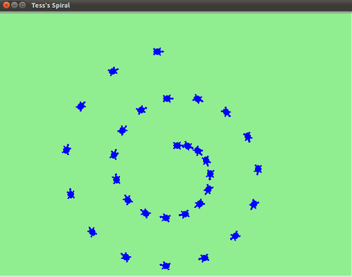

## Vista general de los métodos para Turtle y Screen 

### Turtle

#### Movimiento de Turtle 

##### Mover y dibujar

[`forward()`](https://docs.python.org/3/library/turtle.html#turtle.forward) | [`fd()`](https://docs.python.org/3/library/turtle.html#turtle.fd)

[`backward()`](https://docs.python.org/3/library/turtle.html#turtle.backward) | [`bk()`](https://docs.python.org/3/library/turtle.html#turtle.bk) | [`back()`](https://docs.python.org/3/library/turtle.html#turtle.back)

[`right()`](https://docs.python.org/3/library/turtle.html#turtle.right) | [`rt()`](https://docs.python.org/3/library/turtle.html#turtle.rt)

[`left()`](https://docs.python.org/3/library/turtle.html#turtle.left) | [`lt()`](https://docs.python.org/3/library/turtle.html#turtle.lt)

[`goto()`](https://docs.python.org/3/library/turtle.html#turtle.goto) | [`setpos()`](https://docs.python.org/3/library/turtle.html#turtle.setpos) | [`setposition()`](https://docs.python.org/3/library/turtle.html#turtle.setposition)

[`setx()`](https://docs.python.org/3/library/turtle.html#turtle.setx)

[`sety()`](https://docs.python.org/3/library/turtle.html#turtle.sety)

[`setheading()`](https://docs.python.org/3/library/turtle.html#turtle.setheading) | [`seth()`](https://docs.python.org/3/library/turtle.html#turtle.seth)

[`home()`](https://docs.python.org/3/library/turtle.html#turtle.home)

[`circle()`](https://docs.python.org/3/library/turtle.html#turtle.circle)

[`dot()`](https://docs.python.org/3/library/turtle.html#turtle.dot)

[`stamp()`](https://docs.python.org/3/library/turtle.html#turtle.stamp)

[`clearstamp()`](https://docs.python.org/3/library/turtle.html#turtle.clearstamp)

[`clearstamps()`](https://docs.python.org/3/library/turtle.html#turtle.clearstamps)

[`undo()`](https://docs.python.org/3/library/turtle.html#turtle.undo)

[`speed()`](https://docs.python.org/3/library/turtle.html#turtle.speed)

##### Mostrar el estado de Turtle

[`position()`](https://docs.python.org/3/library/turtle.html#turtle.position) | [`pos()`](https://docs.python.org/3/library/turtle.html#turtle.pos)

[`towards()`](https://docs.python.org/3/library/turtle.html#turtle.towards)

[`xcor()`](https://docs.python.org/3/library/turtle.html#turtle.xcor)

[`ycor()`](https://docs.python.org/3/library/turtle.html#turtle.ycor)

[`heading()`](https://docs.python.org/3/library/turtle.html#turtle.heading)

[`distance()`](https://docs.python.org/3/library/turtle.html#turtle.distance)

##### Medidas
[`degrees()`](https://docs.python.org/3/library/turtle.html#turtle.degrees)

[`radians()`](https://docs.python.org/3/library/turtle.html#turtle.radians)

#### Control del lápiz

##### Estado del lápiz
[`pendown()`](https://docs.python.org/3/library/turtle.html#turtle.pendown) | [`pd()`](https://docs.python.org/3/library/turtle.html#turtle.pd) | [`down()`](https://docs.python.org/3/library/turtle.html#turtle.down)

[`penup()`](https://docs.python.org/3/library/turtle.html#turtle.penup) | [`pu()`](https://docs.python.org/3/library/turtle.html#turtle.pu) | [`up()`](https://docs.python.org/3/library/turtle.html#turtle.up)

[`pensize()`](https://docs.python.org/3/library/turtle.html#turtle.pensize) | [`width()`](https://docs.python.org/3/library/turtle.html#turtle.width)

[`pen()`](https://docs.python.org/3/library/turtle.html#turtle.pen)

[`isdown()`](https://docs.python.org/3/library/turtle.html#turtle.isdown)

##### Control del color

[`color()`](https://docs.python.org/3/library/turtle.html#turtle.color)

[`pencolor()`](https://docs.python.org/3/library/turtle.html#turtle.pencolor)

[`fillcolor()`](https://docs.python.org/3/library/turtle.html#turtle.fillcolor)


##### Relleno

[`filling()`](https://docs.python.org/3/library/turtle.html#turtle.filling)

[`begin_fill()`](https://docs.python.org/3/library/turtle.html#turtle.begin_fill)

[`end_fill()`](https://docs.python.org/3/library/turtle.html#turtle.end_fill)


##### Más controles de dibujo
[`reset()`](https://docs.python.org/3/library/turtle.html#turtle.reset)

[`clear()`](https://docs.python.org/3/library/turtle.html#turtle.clear)

[`write()`](https://docs.python.org/3/library/turtle.html#turtle.write)

#### Estado de Turtle

##### Visibilidad
[`showturtle()`](https://docs.python.org/3/library/turtle.html#turtle.showturtle) | [`st()`](https://docs.python.org/3/library/turtle.html#turtle.st)

[`hideturtle()`](https://docs.python.org/3/library/turtle.html#turtle.hideturtle) | [`ht()`](https://docs.python.org/3/library/turtle.html#turtle.ht)

[`isvisible()`](https://docs.python.org/3/library/turtle.html#turtle.isvisible)

##### Apariencia

[`shape()`](https://docs.python.org/3/library/turtle.html#turtle.shape)

[`resizemode()`](https://docs.python.org/3/library/turtle.html#turtle.resizemode)

[`shapesize()`](https://docs.python.org/3/library/turtle.html#turtle.shapesize) | [`turtlesize()`](https://docs.python.org/3/library/turtle.html#turtle.turtlesize)

[`shearfactor()`](https://docs.python.org/3/library/turtle.html#turtle.shearfactor)

[`settiltangle()`](https://docs.python.org/3/library/turtle.html#turtle.settiltangle)

[`tiltangle()`](https://docs.python.org/3/library/turtle.html#turtle.tiltangle)

[`tilt()`](https://docs.python.org/3/library/turtle.html#turtle.tilt)

[`shapetransform()`](https://docs.python.org/3/library/turtle.html#turtle.shapetransform)

[`get_shapepoly()`](https://docs.python.org/3/library/turtle.html#turtle.get_shapepoly)

#### Uso de eventos

[`onclick()`](https://docs.python.org/3/library/turtle.html#turtle.onclick)

[`onrelease()`](https://docs.python.org/3/library/turtle.html#turtle.onrelease)

[`ondrag()`](https://docs.python.org/3/library/turtle.html#turtle.ondrag)

#### Métodos especiales de Turtle

[`begin_poly()`](https://docs.python.org/3/library/turtle.html#turtle.begin_poly)

[`end_poly()`](https://docs.python.org/3/library/turtle.html#turtle.end_poly)

[`get_poly()`](https://docs.python.org/3/library/turtle.html#turtle.get_poly)

[`clone()`](https://docs.python.org/3/library/turtle.html#turtle.clone)

[`getturtle()`](https://docs.python.org/3/library/turtle.html#turtle.getturtle) | [`getpen()`](https://docs.python.org/3/library/turtle.html#turtle.getpen)

[`getscreen()`](https://docs.python.org/3/library/turtle.html#turtle.getscreen)

[`setundobuffer()`](https://docs.python.org/3/library/turtle.html#turtle.setundobuffer)

[`undobufferentries()`](https://docs.python.org/3/library/turtle.html#turtle.undobufferentries)

## Métodos de TurtleScreen/Screen

### Control de la ventana

[`bgcolor()`](https://docs.python.org/3/library/turtle.html#turtle.bgcolor)

[`bgpic()`](https://docs.python.org/3/library/turtle.html#turtle.bgpic)

[`clear()`](https://docs.python.org/3/library/turtle.html#turtle.clear) | [`clearscreen()`](https://docs.python.org/3/library/turtle.html#turtle.clearscreen)

[`reset()`](https://docs.python.org/3/library/turtle.html#turtle.reset) | [`resetscreen()`](https://docs.python.org/3/library/turtle.html#turtle.resetscreen)

[`screensize()`](https://docs.python.org/3/library/turtle.html#turtle.screensize)

[`setworldcoordinates()`](https://docs.python.org/3/library/turtle.html#turtle.setworldcoordinates)

### Control de la animación

[`delay()`](https://docs.python.org/3/library/turtle.html#turtle.delay)

[`tracer()`](https://docs.python.org/3/library/turtle.html#turtle.tracer)

[`update()`](https://docs.python.org/3/library/turtle.html#turtle.update)

### Uso de eventos de pantalla

[`listen()`](https://docs.python.org/3/library/turtle.html#turtle.listen)

[`onkey()`](https://docs.python.org/3/library/turtle.html#turtle.onkey) | [`onkeyrelease()`](https://docs.python.org/3/library/turtle.html#turtle.onkeyrelease)

[`onkeypress()`](https://docs.python.org/3/library/turtle.html#turtle.onkeypress)

[`onclick()`](https://docs.python.org/3/library/turtle.html#turtle.onclick) | [`onscreenclick()`](https://docs.python.org/3/library/turtle.html#turtle.onscreenclick)

[`ontimer()`](https://docs.python.org/3/library/turtle.html#turtle.ontimer)

[`mainloop()`](https://docs.python.org/3/library/turtle.html#turtle.mainloop) | [`done()`](https://docs.python.org/3/library/turtle.html#turtle.done)

### Configuraciones y métodos especiales

[`mode()`](https://docs.python.org/3/library/turtle.html#turtle.mode)

[`colormode()`](https://docs.python.org/3/library/turtle.html#turtle.colormode)

[`getcanvas()`](https://docs.python.org/3/library/turtle.html#turtle.getcanvas)

[`getshapes()`](https://docs.python.org/3/library/turtle.html#turtle.getshapes)

[`register_shape()`](https://docs.python.org/3/library/turtle.html#turtle.register_shape) | [`addshape()`](https://docs.python.org/3/library/turtle.html#turtle.addshape)

[`turtles()`](https://docs.python.org/3/library/turtle.html#turtle.turtles)

[`window_height()`](https://docs.python.org/3/library/turtle.html#turtle.window_height)

[`window_width()`](https://docs.python.org/3/library/turtle.html#turtle.window_width)

### Métodos de entrada

[`textinput()`](https://docs.python.org/3/library/turtle.html#turtle.textinput)

[`numinput()`](https://docs.python.org/3/library/turtle.html#turtle.numinput)

### Métodos específicos de Screen

[`bye()`](https://docs.python.org/3/library/turtle.html#turtle.bye)

[`exitonclick()`](https://docs.python.org/3/library/turtle.html#turtle.exitonclick)

[`setup()`](https://docs.python.org/3/library/turtle.html#turtle.setup)

[`title()`](https://docs.python.org/3/library/turtle.html#turtle.title)

# Ejercicios

1.- Crea mediante funciones las siguientes formas geométricas:

- un cuadrado de tamaño `side`

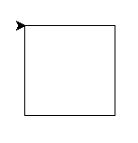

SOLUCIÓN: [eje0101.py](https://raw.githubusercontent.com/mentecatoDev/intermezzo/master/docs/eje_la_tortuga_que_dibuja/eje0101.py)


- una estrella de cinco puntas de lado `side`

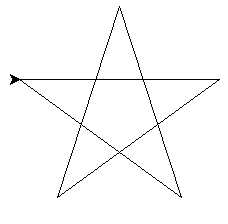

SOLUCIÓN: [eje0102.py](https://raw.githubusercontent.com/mentecatoDev/intermezzo/master/docs/eje_la_tortuga_que_dibuja/eje0102.py)


- un polígono de `sides` lados de longitud `side_lenght`

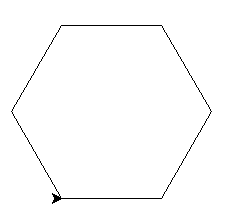

SOLUCIÓN: [eje0103.py](https://raw.githubusercontent.com/mentecatoDev/intermezzo/master/docs/eje_la_tortuga_que_dibuja/eje0103.py)


- una espiral cuadrada azul en fondo verde de lado `size` y decremento `dec`

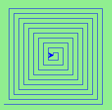

SOLUCIÓN: [eje0104.py](https://raw.githubusercontent.com/mentecatoDev/intermezzo/master/docs/eje_la_tortuga_que_dibuja/eje0104.py)

2.- Crear un programa que dibuje líneas de ancho creciente alrededor de un punto central:

- creando un patrón atractivo.

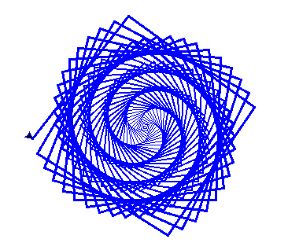

SOLUCIÓN: [eje0201.py](https://raw.githubusercontent.com/mentecatoDev/intermezzo/master/docs/eje_la_tortuga_que_dibuja/eje0201.py)

- partiendo del ejercicio anterior pero creando un patrón hexagonal

  

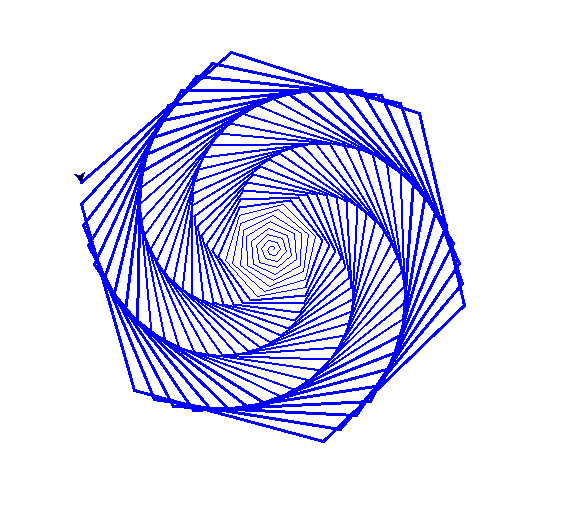

SOLUCIÓN: [eje0202.py](https://raw.githubusercontent.com/mentecatoDev/intermezzo/master/docs/eje_la_tortuga_que_dibuja/eje0202.py)

- terminar dando color para construir el "Arcoiris de Benceno"

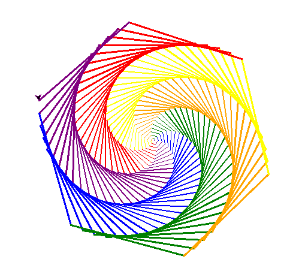

SOLUCIÓN: [eje0203.py](https://raw.githubusercontent.com/mentecatoDev/intermezzo/master/docs/eje_la_tortuga_que_dibuja/eje0203.py)

