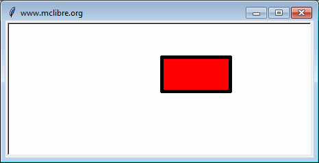
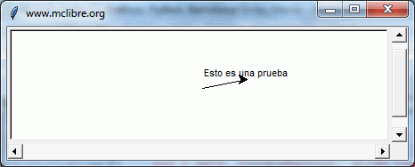

# La tortuga que dibuja

En 1967 *Wally Feurzeig* y [*Seymour Papert*](https://www.youtube.com/watch?v=2js2cFrtg8I) crearon **Logo**, un lenguaje de programación con fines educativos. Ese lenguaje incluía los "gráficos de tortuga". La "tortuga" de Logo es un cursor al que se le pueden dar órdenes de movimiento (avance, retroceso o giro) y que puede ir dejando un rastro sobre la pantalla. Moviendo adecuadamente la tortuga se puede conseguir dibujar todo tipo de figuras.

Python incluye un módulo llamado `turtle` que permite crear éste tipo de **gráficos tortuga**.

Para utilizar el módulo turtle sólo hace falta importarlo:

- Si se va a escribir código no orientado a objetos:

```python
from turtle import *
```

- Si se va a escribir código orientado a objetos (que es la que se usará a partir de ahora):

```python
import turtle
```
## La ventana de dibujo: setup() y title()
El módulo `turtle` dibuja en una ventana propia.

El método/función `setup(ancho, alto, posicionX, posicionY)` permite definir el tamaño y la posición inicial de la ventana. Los cuatro argumentos de la función son (en píxeles):

- **ancho**: ancho de la ventana.
- **alto**: alto de la ventana.
- **posicionX**: posición horizontal de la ventana. Los valores positivos se miden desde el borde izquierdo de la pantalla, los negativos desde el borde derecho de la pantalla.
- **posicionY**: posición vertical de la ventana. Los valores positivos se miden desde el borde superior de la pantalla, los negativos desde el borde inferior de la pantalla.


## El primer programa con tortugas

Se van a trazar un par de líneas en la terminal de Python para crear una nueva tortuga y empezar a dibujar un rectángulo. (La variable que refiere a la primera tortuga se llamará `raphael`).

FICHERO: `tortuga01.py`

```python
import turtle

# Set the window size to 800x600 pixels at (0, 0)
turtle.setup(800, 600, 0, 0)

# Set the Screen object as wn
wn = turtle.Screen()

# Creates the turtle
leonardo = turtle.Turtle()
leonardo.forward(300)
leonardo.left(90)
leonardo.forward(200)

wn.exitonclick()

```

Tras la segunda instrucción, se abrirá una nueva ventana. El tercer comando coloca un cursor –llamando cariñosamente a una `turtle` del módulo– a la que se le ha puesto el nombre de `raphael`. Las siguientes tres líneas mueven a `raphael` hacia adelante, gira hacia la izquierda, y lo mueve hacia adelante una vez más, completando dos lados de un rectángulo.

Después de introducir estos comandos, se verá una ventana que se parecerá a esto:


Aquí hay un par de cosas que se necesita entender acerca de este programa.

- La primera línea le dice a Python que cargue un módulo llamado `turtle`. Dicho módulo trae dos nuevos tipos que se pueden utilizar: la clase `Turtle`, y la clase `Screen`. La notación de puntos `turtle.Turtle` significa *“La clase* `Turtle` *definida en el módulo* `turtle`*”* (Python distingue entre mayúsculas y minúsculas, así que el nombre del módulo, con una `t` minúscula, es diferente al que la tiene mayúscula).
- A continuación, se crea y abre lo que se llama una `Screen`, que se asigna a la variable `wn`. Cada `Screen` contiene un lienzo (**canvas**), que es el área dentro de ella en la que se puede dibujar. En la siguiente línea se crea una tortuga. La variable `leonardo` se usa para referirse a ella. Estas tres primeras líneas son la preparación para ahora hacer algunas cosas útiles.
- A continuación se instruye al **objeto** `leonardo` para que se mueva, y que gire. Se hace mediante la **invocación** a los **métodos** de `leonardo` —instrucciones a las que todas las tortugas saben cómo responder.
- La última línea también desempeña un papel: la variable `wn` se refiere a la ventana activa. Cuando se invoca el método `exitonclick`,  se detiene la ejecución del programa y se espera a que el usuario haga *click* con el ratón en algún lugar de la ventana. Cuando este evento *click* se produce, la respuesta es cerrar la ventana de la tortuga y la salida (la ejecución de la parada) del programa de Python.

Un objeto puede tener varios métodos —las cosas que puede hacer— y también puede tener **atributos** (también llamados *propiedades*). Por ejemplo, cada tortuga (`Turtle`) tiene un atributo `color`. El modo de invocarlo es `leonardo.color("red")` que hará a `leonardo` rojo, y el dibujo será de color rojo también. El color de la tortuga, la anchura de la pluma, la posición de la tortuga dentro de la ventana, la apariencia, etc. son partes de su **estado** actual. Del mismo modo, el objeto `Screen` tiene un color de fondo y un texto en la barra de título, y un tamaño y posición en la pantalla. Todos ellos forman parte del estado del objeto `screen`. Hay un buen número de métodos que nos permiten modificar tortugas y screens. Vamos a mostrar un par:

FICHERO: `tortuga02.py`

```python
import turtle

# set the window size to 800 by 600 pixels at (0, 0)
turtle.setup(800, 600, 0, 0)

# set wn as a window object
wn = turtle.Screen()  

# set the background color of the window
wn.bgcolor("lightgreen")

# set the title of the window
wn.title("¡Hola, Raphael!")
raphael = turtle.Turtle()
raphael.color("blue")      # make raphael blue
raphael.pensize(3)         # set the width of the pen
raphael.forward(300)
raphael.left(120)
raphael.forward(300)

wn.exitonclick()

```

La ejecución de este programa creará una ventana gráfica que se verá así:


Cuando se ejecuta este programa aparece esta nueva ventana y permanecerá en pantalla hasta que se haga clic en ella.


> Nota:
>
> Se puede encontrar una lista de nombres de colores permitidos en http://www.tcl.tk/man/tcl8.4/TkCmd/colors.htm. Incluye algunos bastante inusuales, como `peach puff` (bocanada de melocotón) y `HotPink` (rosa caliente)

## Una manada de tortugas

Al igual que podemos tener muchos enteros diferentes en un programa, podemos tener muchas tortugas. Cada una de ellas es una **instancia**. Cada instancia tiene sus propios atributos y métodos -por lo que `raphael` puede dibujar con un lápiz negro delgado y estar en alguna posición, mientras que `donatello` podría ir en su propia dirección con un bolígrafo de color rosa grueso (`fat pink`). Aquí está lo que sucede cuando `raphael` termina su rectángulo, y `donatello` completa su triángulo:

FICHERO: `tortuga03.py`

```python
import turtle

# setup the window and its attributes
turtle.setup(800, 600, 0, 0)
wn = turtle.Screen()
wn.bgcolor("lightgreen")
wn.title("donatello & raphael")

# instantiate (create) donatello and set his attributes
donatello = turtle.Turtle()
donatello.color("hotpink")
donatello.pensize(5)

# instantiate raphael
raphael = turtle.Turtle()

# draw an equilateral triangle with donatello
donatello.forward(320)
donatello.left(120)
donatello.forward(320)
donatello.left(120)
donatello.forward(320)
donatello.left(120)

# turn donatello around and move her away from the origin
donatello.right(180)
donatello.forward(320)

# make raphael draw a square
raphael.forward(200)
raphael.left(90)
raphael.forward(200)
raphael.left(90)
raphael.forward(200)
raphael.left(90)
raphael.forward(200)

wn.exitonclick()

```

que genera esto cuando se ejecuta:


## Algunos trucos y métodos de tortugas

### `showturtle()`, `hideturtle()`

El método `showturtle()` muestra el cursor (la tortuga) mientras que `hideturtle()` la oculta.

### `penup()` y `pendown()`

Los métodos `pendown()` y `penup()` son equivalentes a bajar y levantar el lápiz del papel. Una vez levantado el lápiz del papel, al desplazar la tortuga ya no se dibujan segmentos. Al volver a bajar el lápiz y desplazar la tortuga, vuelven a dibujarse los segmentos.

### `goto()`, `setx()` y `sety()`

Los píxeles del área de dibujo se pueden localizar mediante un sistema de coordenadas XY centrado en el centro del área de dibujo. Al crear la ventana, el cursor se sitúa en el centro de la ventana, de coordenadas (0, 0).

La función `goto(x, y)` permite desplazar el cursor a una posición determinada del área de dibujo y, si la tortuga tiene su lápiz abajo (`pendown`) traza el recorrido desde la posición actual a las coordenadas indicadas por `x` e `y` del método `goto`.

`setx(x)` y `sety(y)` realizan la misma función que `goto` pero tocando solo una de las dos coordenadas de destino.

### `pensize()`, `pencolor()` y `colormode()`
El método `pensize(grosor)` permite modificar el grosor del trazo.
El método `pencolor(rojo, azul, verde)` permite modificar el color del trazo. El color se da como combinación de rojo, azul y verde. Los valores de color se pueden dar como valores enteros entre 0 y 255 o como valores decimales entre 0 y 1. Para elegir entre un modo u otro se utiliza la función `colormode(1)` o `colormode(255)`. También se pueden utilizar nombres de colores, que incluyen entre otros los [nombres de colores SVG](https://www.mclibre.org/consultar/htmlcss/css/css-color.html#svg), en cuyo caso no hace falta utilizar el método `colormode()`.

### `dot()`

La función **dot(grosor, color)** permite dibujar un punto del grosor y color indicado en el punto en el que se encuentre la tortuga. El grosor se indica en píxeles y el color se expresa como en la función **pencolor()** vista en el apartado anterior (entre paréntesis, como tupla, o sin paréntesis). Los puntos se dibujan indistintamente de la posición del lápiz (`penup`, `pendown`).

### Ángulos y distancias **negativas** 

Los métodos de la tortuga pueden utilizar ángulos y distancias negativas. Así `donatello.forward(-100)` moverá a `donatello` hacia atrás y `donatello.left(-30)` lo gira a la derecha.

Además, dado que hay 360 grados en un círculo, al girar 30 a la izquierda se estará en la misma situación que si se gira 330 a la derecha! (La animación en la pantalla será diferente).También hay un método `backward` (si se es muy nerd, uno puede disfrutar de mover a `raphael` hacia adelante mediante `raphael.backward(-100)`).

### Formas de tortuga: `shape()`

Cada tortuga puede tener su propia forma. Las que están disponibles  son `arrow` (flecha), `blank` (espacio en blanco), `circle` (círculo), `classic` (clásico), `square` (cuadrado), `triangle` (triángulo), `turtle` (tortuga).

```python
raphael.shape("turtle")
```

### Velocidad: `speed()`

Se puede acelerar o ralentizar la **velocidad** de la animación de la tortuga. El ajuste de velocidad varía entre 1 (lento) a 10 (más rápido). Sin embargo, si se establece la velocidad a 0 se **desactivará la animación** y se irá lo más rápido posible.

```python
raphael.speed(10)
```

### Sello: `stamp()`

Una tortuga puede crear un “sello” (`stamp`) de su huella en el lienzo que seguirá así después de que la tortuga se haya movido a otra parte. Se sella, aun cuando la pluma esté arriba.

El siguiente ejemplo muestra algunas de estas nuevas características:

FICHERO: `tortuga04.py`

```python
import turtle

turtle.setup(800, 600, 0, 0)
wn = turtle.Screen()
wn.bgcolor("lightgreen")
wn.title("Donatello's Spiral")
donatello = turtle.Turtle()
donatello.shape("turtle")
donatello.color("blue")

donatello.penup()            # this is new
size = 20
for i in range(30):
    donatello.stamp()        # leave an impression on the canvas
    size = size + 3          # increase the size on every iteration
    donatello.forward(size)  # move donatello along
    donatello.right(24)      # and turn her

turtle.done()

```
que genera esto cuando se ejecuta:


## Relleno de figuras

El método `begin_fill()` indica a Python que las figuras que se dibujen a partir de ese momento se deben rellenar. El método `end_fill()` indica a Python que las figuras deben dejar de rellenarse.

El método `fillcollor(color)` permite establecer el color de relleno, de la misma manera que la función `pencolor()`.

Si no se establece un color de relleno distinto, el color de relleno predeterminado es el negro.

Para rellenar una figura, se debe llamar a la función `begin_fill()`, dibujar la figura y llamar a la función `end_fill()`.

FICHERO: `tortuga05.py`

```python
import turtle

wn = turtle.Screen()
wn.setup(800, 600, 0, 0)
wn.title("Relleno de figuras")

leonardo = turtle.Turtle()
leonardo.hideturtle()

leonardo.pensize(5)
leonardo.fillcolor("red")

leonardo.begin_fill()
leonardo.goto(100, 0)
leonardo.goto(100, 50)
leonardo.goto(0, 50)
leonardo.goto(0, 0)
leonardo.end_fill()

wn.exitonclick()
```



Si no se establece un color de relleno distinto, el color de relleno predeterminado es el negro.

Aunque realmente no es necesario dibujar la figura completa ya que Python rellena la figura aunque no se cierre  (es como si Python uniera el último punto de la figura con el primero).

Si las líneas de la figura se cruzan, Python rellena cada una de las partes cerradas.

FICHERO: `turtle06.py`

```python
import turtle

wn = turtle.Screen()
wn.setup(800, 600, 0, 0)
wn.title("Relleno de figuras")

leonardo = turtle.Turtle()
leonardo.speed(1)

leonardo.pensize(5)
leonardo.fillcolor("red")
leonardo.begin_fill()
leonardo.goto(100, 100)
leonardo.goto(200, -100)
leonardo.goto(300, 0)
leonardo.goto(0, 0)
leonardo.end_fill()
leonardo.hideturtle()

wn.exitonclick()
```

  

### Cambio de coordenadas: `setworldcoordinates()`

La función `setworldcoordinates(x1, y1, x2, y2)` permite modificar las coordenadas de la ventana, definiendo las coordenadas de la esquina inferior izquierda (x1, y1) y de la esquina superior derecha (x2, y2).

El interés de esta función es poder **desplazar el origen del centro de coordenadas** y **cambiar la escala**:

- De forma predeterminada, el origen está en el centro de la ventana y cada píxel es una unidad:

```python
import turtle

wn = turtle.Screen()
wn.setup(450, 200, 0, 0)
wn.title("Romero Vargas")

leonardo = turtle.Turtle()
leonardo.hideturtle()
leonardo.goto(150, 150)

wn.exitonclick()
```


- Con `setworldcoordinates()` se puede cambiar las coordenadas de manera que el origen esté en cualquier sitio, por ejemplo en la esquina inferior izquierda.

```python
import turtle

wn = turtle.Screen()
wn.setup(450, 200, 0, 0)
wn.title("www.mclibre.org")
wn.setworldcoordinates(0, 0, 449, 199)

leonardo = turtle.Turtle()
leonardo.hideturtle()
leonardo.goto(150, 150)

wn.exitonclick()
```

  


## Escribir texto: `write()`

La función `write(texto, desplazarTortuga, alineación, fuente)` permite escribir texto en el espacio de dibujo. Los cuatro argumentos de la función son:

- **texto**: cadena de texto a escribir. La esquina inferior izquierda del texto se sitúa donde esté el cursor, salvo que se indique otra cosa con el tercer argumento (alineación).

```python
import turtle

wn = turtle.Screen()
wn.setup(800, 600, 0, 0)

leonardo = turtle.Turtle()
leonardo.goto(50, 10)
leonardo.write("Esto es una prueba")

wn.exitonclick()
```


- **desplazarTortuga**: valor booleano que indica si el cursor se desplaza automáticamente a la esquina inferior derecha del texto. El valor predeterminado es `False`

```python
import turtle

wn = turtle.Screen()
wn.setup(800, 600, 0, 0)

leonardo = turtle.Turtle()
leonardo.goto(50, 10)
leonardo.write("Esto es una prueba", True)

wn.exitonclick()
```

]

- **alineación**: cadena (`left`, `center`, `right`) que indica si el texto se escribe a la izquierda, al centro o a la derecha a partir de la posición del cursor. El valor predeterminado es `left`.

```python
from turtle import *

setup(450, 150, 0, 0)
screensize(300, 150)
title("www.mclibre.org")

goto(50,10)
write("Esto es una prueba", False, "left")
```





- **fuente**: tupla de hasta tres elementos que indican el tipo de letra (cualquiera de los instalados en el ordenador: "arial", "courier", etc.), su tamaño y variante ("bold", "italic", "underline", "overstrike" -se pueden utilizar varios a la vez-).

```python
import turtle

wn = turtle.Screen()
wn.setup(800, 600, 0, 0)

leonardo = turtle.Turtle()
leonardo.goto(50, 10)
leonardo.write("Esto es una prueba", False, "right", ("arial", 20, "bold italic"))

wn.exitonclick()
```

]

> Se pueden omitir los últimos argumentos, pero no los anteriores. Por ejemplo, podemos omitir el tipo de letra (el cuarto argumento), pero si queremos especificar el tipo de letra, debemos indicar los tres argumentos anteriores.

## Solicitar valores al usuario: textinput() y numinput()

Para pedir datos al usuario en un programa que dibuja gráficos de tortuga se pueden utilizar la función `input()`. El inconveniente es que esta función solicita los datos en la ventana de la consola, por lo que hay que estar cambiando el foco de una ventana a otra.

En vez de la función `input()`, se pueden utilizar las funciones `textinput()` y `numinput()` de la biblioteca `turtle`.

La función `textinput(<título>, <mensaje>)` solicita una cadena al usuario en una ventana emergente. Los dos argumentos de la función son:

- **título**: el título de la ventana emergente.
- **mensaje**: el texto que se muestra en la ventana.

```python
import turtle

wn = turtle.Screen()
wn.setup(800, 600, 0, 0)

name = wn.textinput("Nombre", "¿Cuál es su nombre?")
leonardo = turtle.Turtle()
leonardo.write(name)

wn.exitonclick()
```


El método `numinput(<título>, <mensaje>, <valorPredeterminado>, <valorMínimo>, <valorMáximo>)` solicita un número al usuario en una ventana emergente. Los dos argumentos de la función son:

- **título**: el título de la ventana emergente.
- **mensaje**: el texto que se muestra en la ventana.
- **valorPredeterminado**: el valor que se muestra en la ventana de forma predeterminada.
- **valorMínimo**: el valor mínimo que puede escribir el usuario.
- **valorMáximo**: el valor máximo que puede escribir el usuario.

```python
from turtle import *

setup(450, 150, 0, 0)
screensize(300, 150)
title("www.mclibre.org")

edad = numinput("Edad", "¿Cuál es su edad?", 20, 0, 120)
```


Si se escribe un valor numérico menor que valorMínimo o mayor que valorMáximo, se mostrará un aviso.

## Vista general de los métodos para Turtle y Screen 

### Turtle

#### Movimiento de Turtle 

##### Mover y dibujar

[`forward()`](https://docs.python.org/3/library/turtle.html#turtle.forward) | [`fd()`](https://docs.python.org/3/library/turtle.html#turtle.fd)

[`backward()`](https://docs.python.org/3/library/turtle.html#turtle.backward) | [`bk()`](https://docs.python.org/3/library/turtle.html#turtle.bk) | [`back()`](https://docs.python.org/3/library/turtle.html#turtle.back)

[`right()`](https://docs.python.org/3/library/turtle.html#turtle.right) | [`rt()`](https://docs.python.org/3/library/turtle.html#turtle.rt)

[`left()`](https://docs.python.org/3/library/turtle.html#turtle.left) | [`lt()`](https://docs.python.org/3/library/turtle.html#turtle.lt)

[`goto()`](https://docs.python.org/3/library/turtle.html#turtle.goto) | [`setpos()`](https://docs.python.org/3/library/turtle.html#turtle.setpos) | [`setposition()`](https://docs.python.org/3/library/turtle.html#turtle.setposition)

[`setx()`](https://docs.python.org/3/library/turtle.html#turtle.setx)

[`sety()`](https://docs.python.org/3/library/turtle.html#turtle.sety)

[`setheading()`](https://docs.python.org/3/library/turtle.html#turtle.setheading) | [`seth()`](https://docs.python.org/3/library/turtle.html#turtle.seth)

[`home()`](https://docs.python.org/3/library/turtle.html#turtle.home)

[`circle()`](https://docs.python.org/3/library/turtle.html#turtle.circle)

[`dot()`](https://docs.python.org/3/library/turtle.html#turtle.dot)

[`stamp()`](https://docs.python.org/3/library/turtle.html#turtle.stamp)

[`clearstamp()`](https://docs.python.org/3/library/turtle.html#turtle.clearstamp)

[`clearstamps()`](https://docs.python.org/3/library/turtle.html#turtle.clearstamps)

[`undo()`](https://docs.python.org/3/library/turtle.html#turtle.undo)

[`speed()`](https://docs.python.org/3/library/turtle.html#turtle.speed)

##### Mostrar el estado de Turtle

[`position()`](https://docs.python.org/3/library/turtle.html#turtle.position) | [`pos()`](https://docs.python.org/3/library/turtle.html#turtle.pos)

[`towards()`](https://docs.python.org/3/library/turtle.html#turtle.towards)

[`xcor()`](https://docs.python.org/3/library/turtle.html#turtle.xcor)

[`ycor()`](https://docs.python.org/3/library/turtle.html#turtle.ycor)

[`heading()`](https://docs.python.org/3/library/turtle.html#turtle.heading)

[`distance()`](https://docs.python.org/3/library/turtle.html#turtle.distance)

##### Medidas
[`degrees()`](https://docs.python.org/3/library/turtle.html#turtle.degrees)

[`radians()`](https://docs.python.org/3/library/turtle.html#turtle.radians)

#### Control del lápiz

##### Estado del lápiz
[`pendown()`](https://docs.python.org/3/library/turtle.html#turtle.pendown) | [`pd()`](https://docs.python.org/3/library/turtle.html#turtle.pd) | [`down()`](https://docs.python.org/3/library/turtle.html#turtle.down)

[`penup()`](https://docs.python.org/3/library/turtle.html#turtle.penup) | [`pu()`](https://docs.python.org/3/library/turtle.html#turtle.pu) | [`up()`](https://docs.python.org/3/library/turtle.html#turtle.up)

[`pensize()`](https://docs.python.org/3/library/turtle.html#turtle.pensize) | [`width()`](https://docs.python.org/3/library/turtle.html#turtle.width)

[`pen()`](https://docs.python.org/3/library/turtle.html#turtle.pen)

[`isdown()`](https://docs.python.org/3/library/turtle.html#turtle.isdown)

##### Control del color

[`color()`](https://docs.python.org/3/library/turtle.html#turtle.color)

[`pencolor()`](https://docs.python.org/3/library/turtle.html#turtle.pencolor)

[`fillcolor()`](https://docs.python.org/3/library/turtle.html#turtle.fillcolor)


##### Relleno

[`filling()`](https://docs.python.org/3/library/turtle.html#turtle.filling)

[`begin_fill()`](https://docs.python.org/3/library/turtle.html#turtle.begin_fill)

[`end_fill()`](https://docs.python.org/3/library/turtle.html#turtle.end_fill)


##### Más controles de dibujo
[`reset()`](https://docs.python.org/3/library/turtle.html#turtle.reset)

[`clear()`](https://docs.python.org/3/library/turtle.html#turtle.clear)

[`write()`](https://docs.python.org/3/library/turtle.html#turtle.write)

#### Estado de Turtle

##### Visibilidad
[`showturtle()`](https://docs.python.org/3/library/turtle.html#turtle.showturtle) | [`st()`](https://docs.python.org/3/library/turtle.html#turtle.st)

[`hideturtle()`](https://docs.python.org/3/library/turtle.html#turtle.hideturtle) | [`ht()`](https://docs.python.org/3/library/turtle.html#turtle.ht)

[`isvisible()`](https://docs.python.org/3/library/turtle.html#turtle.isvisible)

##### Apariencia

[`shape()`](https://docs.python.org/3/library/turtle.html#turtle.shape)

[`resizemode()`](https://docs.python.org/3/library/turtle.html#turtle.resizemode)

[`shapesize()`](https://docs.python.org/3/library/turtle.html#turtle.shapesize) | [`turtlesize()`](https://docs.python.org/3/library/turtle.html#turtle.turtlesize)

[`shearfactor()`](https://docs.python.org/3/library/turtle.html#turtle.shearfactor)

[`settiltangle()`](https://docs.python.org/3/library/turtle.html#turtle.settiltangle)

[`tiltangle()`](https://docs.python.org/3/library/turtle.html#turtle.tiltangle)

[`tilt()`](https://docs.python.org/3/library/turtle.html#turtle.tilt)

[`shapetransform()`](https://docs.python.org/3/library/turtle.html#turtle.shapetransform)

[`get_shapepoly()`](https://docs.python.org/3/library/turtle.html#turtle.get_shapepoly)

#### Uso de eventos

[`onclick()`](https://docs.python.org/3/library/turtle.html#turtle.onclick)

[`onrelease()`](https://docs.python.org/3/library/turtle.html#turtle.onrelease)

[`ondrag()`](https://docs.python.org/3/library/turtle.html#turtle.ondrag)

#### Métodos especiales de Turtle

[`begin_poly()`](https://docs.python.org/3/library/turtle.html#turtle.begin_poly)

[`end_poly()`](https://docs.python.org/3/library/turtle.html#turtle.end_poly)

[`get_poly()`](https://docs.python.org/3/library/turtle.html#turtle.get_poly)

[`clone()`](https://docs.python.org/3/library/turtle.html#turtle.clone)

[`getturtle()`](https://docs.python.org/3/library/turtle.html#turtle.getturtle) | [`getpen()`](https://docs.python.org/3/library/turtle.html#turtle.getpen)

[`getscreen()`](https://docs.python.org/3/library/turtle.html#turtle.getscreen)

[`setundobuffer()`](https://docs.python.org/3/library/turtle.html#turtle.setundobuffer)

[`undobufferentries()`](https://docs.python.org/3/library/turtle.html#turtle.undobufferentries)

## Métodos de TurtleScreen/Screen

### Control de la ventana

[`bgcolor()`](https://docs.python.org/3/library/turtle.html#turtle.bgcolor)

[`bgpic()`](https://docs.python.org/3/library/turtle.html#turtle.bgpic)

[`clear()`](https://docs.python.org/3/library/turtle.html#turtle.clear) | [`clearscreen()`](https://docs.python.org/3/library/turtle.html#turtle.clearscreen)

[`reset()`](https://docs.python.org/3/library/turtle.html#turtle.reset) | [`resetscreen()`](https://docs.python.org/3/library/turtle.html#turtle.resetscreen)

[`screensize()`](https://docs.python.org/3/library/turtle.html#turtle.screensize)

[`setworldcoordinates()`](https://docs.python.org/3/library/turtle.html#turtle.setworldcoordinates)

### Control de la animación

[`delay()`](https://docs.python.org/3/library/turtle.html#turtle.delay)

[`tracer()`](https://docs.python.org/3/library/turtle.html#turtle.tracer)

[`update()`](https://docs.python.org/3/library/turtle.html#turtle.update)

### Uso de eventos de pantalla

[`listen()`](https://docs.python.org/3/library/turtle.html#turtle.listen)

[`onkey()`](https://docs.python.org/3/library/turtle.html#turtle.onkey) | [`onkeyrelease()`](https://docs.python.org/3/library/turtle.html#turtle.onkeyrelease)

[`onkeypress()`](https://docs.python.org/3/library/turtle.html#turtle.onkeypress)

[`onclick()`](https://docs.python.org/3/library/turtle.html#turtle.onclick) | [`onscreenclick()`](https://docs.python.org/3/library/turtle.html#turtle.onscreenclick)

[`ontimer()`](https://docs.python.org/3/library/turtle.html#turtle.ontimer)

[`mainloop()`](https://docs.python.org/3/library/turtle.html#turtle.mainloop) | [`done()`](https://docs.python.org/3/library/turtle.html#turtle.done)

### Configuraciones y métodos especiales

[`mode()`](https://docs.python.org/3/library/turtle.html#turtle.mode)

[`colormode()`](https://docs.python.org/3/library/turtle.html#turtle.colormode)

[`getcanvas()`](https://docs.python.org/3/library/turtle.html#turtle.getcanvas)

[`getshapes()`](https://docs.python.org/3/library/turtle.html#turtle.getshapes)

[`register_shape()`](https://docs.python.org/3/library/turtle.html#turtle.register_shape) | [`addshape()`](https://docs.python.org/3/library/turtle.html#turtle.addshape)

[`turtles()`](https://docs.python.org/3/library/turtle.html#turtle.turtles)

[`window_height()`](https://docs.python.org/3/library/turtle.html#turtle.window_height)

[`window_width()`](https://docs.python.org/3/library/turtle.html#turtle.window_width)

### Métodos de entrada

[`textinput()`](https://docs.python.org/3/library/turtle.html#turtle.textinput)

[`numinput()`](https://docs.python.org/3/library/turtle.html#turtle.numinput)

### Métodos específicos de Screen

[`bye()`](https://docs.python.org/3/library/turtle.html#turtle.bye)

[`exitonclick()`](https://docs.python.org/3/library/turtle.html#turtle.exitonclick)

[`setup()`](https://docs.python.org/3/library/turtle.html#turtle.setup)

[`title()`](https://docs.python.org/3/library/turtle.html#turtle.title)

# Ejercicios

1.- Crea mediante funciones las siguientes formas geométricas:

- un cuadrado de tamaño `side`


SOLUCIÓN: [eje0101.py](https://raw.githubusercontent.com/mentecatoDev/intermezzo/master/docs/eje_la_tortuga_que_dibuja/eje0101.py)


- una estrella de cinco puntas de lado `side`


SOLUCIÓN: [eje0102.py](https://raw.githubusercontent.com/mentecatoDev/intermezzo/master/docs/eje_la_tortuga_que_dibuja/eje0102.py)


- un polígono de `sides` lados de longitud `side_lenght`


SOLUCIÓN: [eje0103.py](https://raw.githubusercontent.com/mentecatoDev/intermezzo/master/docs/eje_la_tortuga_que_dibuja/eje0103.py)


- una espiral cuadrada azul en fondo verde de lado `size` y decremento `dec`


SOLUCIÓN: [eje0104.py](https://raw.githubusercontent.com/mentecatoDev/intermezzo/master/docs/eje_la_tortuga_que_dibuja/eje0104.py)

2.- Crear un programa que dibuje líneas de ancho creciente alrededor de un punto central:

- creando un patrón atractivo.


SOLUCIÓN: [eje0201.py](https://raw.githubusercontent.com/mentecatoDev/intermezzo/master/docs/eje_la_tortuga_que_dibuja/eje0201.py)

- partiendo del ejercicio anterior pero creando un patrón hexagonal

  


SOLUCIÓN: [eje0202.py](https://raw.githubusercontent.com/mentecatoDev/intermezzo/master/docs/eje_la_tortuga_que_dibuja/eje0202.py)

- terminar dando color para construir el "Arcoiris de Benceno"


SOLUCIÓN: [eje0203.py](https://raw.githubusercontent.com/mentecatoDev/intermezzo/master/docs/eje_la_tortuga_que_dibuja/eje0203.py)

3.- Contamos con un fichero [covid-19.txt](https://raw.githubusercontent.com/mentecatoDev/intermezzo/master/docs/eje_la_tortuga_que_dibuja/covid-19.txt) que mantiene un histórico de contagios del virus que nos está confinando con el siguiente formato por línea:

```
<fecha "aaaammdd">, <casos>, <fallecidos>, <recuperados>
```
Se trata de construir un gráfico por cada uno de los parámetros ofrecidos por este fichero además de un parámetro calculado, `<casos/día>`, que nos permitirá describir el proceso de evolución de la curva de contagios. Los gráficos han de ser semejantes a los siguientes:


Se recomienda:

- Hacer uso de funciones para la reutilización del código
- Utilizar parámetros para generalizar las posibilidades de reutilización del código

SOLUCIÓN: [eje0300.py](https://raw.githubusercontent.com/mentecatoDev/intermezzo/master/docs/eje_la_tortuga_que_dibuja/eje0300.py)